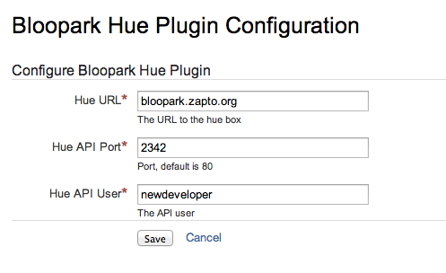
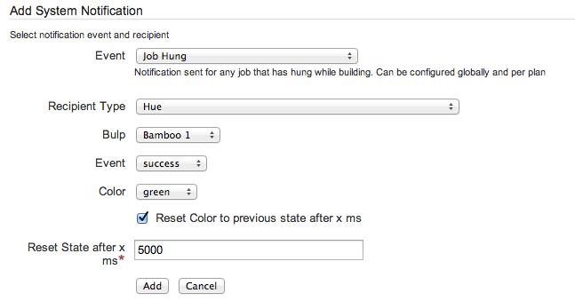
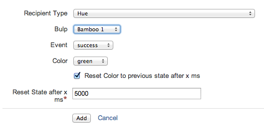

# bam!hue Add-On 

The bam!hue add-on is an extension of Atlassian Bamboo notification center for Philips hue light bulbs API. Bam!hue sends and visualises the information about build-status and test-status of Bamboo directly to hue API. On this way the development team will be instantly informed about current status of project and can react as fast as possible.   

We have recently developed a philips hue application that instantly notificates our colleagues, software developers and server administrators, about succesfull and failed server builds with the power of lights. 

## Features

- Easy setup of HUE-API in Bamboo backend
- Easy setup of notifications for any Event / Build-Job
- Automatic recognition of lamps, connected to HUE brigde
- Possibility to configure every lamp individually
- Possibility to define colors for every event and lamp individually
- Possibility to create several configurations for one lamp
- Automatic return to initial lamp color / mode - Connection though Intranet und Internet


## Installation

Installation will be done through the UPM manager: In UPM chose Upload add-on option in order to install bam!hue plugin via URL or downloaded file.

## Configuration

Configuration will be done in 2 steps: Backend setting and notifications settings.

### Backend settings

After installation a new navigation point appears in administration area: *Configure Hue*. The URL, port and API user have to be set up here.



**Notice**

If the *hue bridge* is not in the same network as the Atlassian Banboo server, you can use such services as dyndns.org or no-ip.com if no static IP is available. Configuration of internal firewall is important here. For security reasons we recommend not to redirect port 80 of Hue-bridge directly, but to use another port as shown in the example above.

### Creation of notification system

Notification system will be called in all kind of events. The systemwide notifications will be created in this way:

- Login as administrator in backend.
- Chose relevant event in navigation point *System Notifications*.
- Chose bam!hue plugin as a *Recipient Type*.



- This configuration can be repeated for any lamp and event until all the information is visualized through hue-API.

### Creation of notifications per Bamboo build plan

After the initial setup in backend has been done, create notifications for each build plan:

- Chose *Configure Plan* in the overview for the plan you want to extend.
- Select tab *Notifications*.
- Select an *event*.
- Choose bam!hue Plugin for *Recipient Type*.



- This configuration can be repeated for any lamp and event until all the information is visualized through hue-API.

## Development

- If you don't have the hue bridge next to you, you can use the [hue emulator](http://steveyo.github.io/Hue-Emulator/).
- Clone this repository.
- To start the local bamboo instance run ```atlas-run``` inside cloned repository.
- To updating the code when bamboo is already running use ```atlas-cli``` in another terminal and write ```pi```.
- To compile the plugin and build a package run ```atlas-package```.